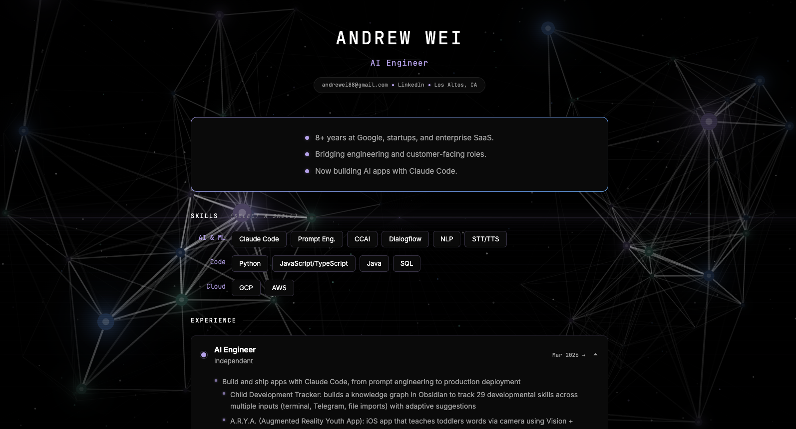

# Neural Resume

An interactive resume built as a single HTML file with a neural network theme.

**[View Live](https://andrewei88.github.io)**

## Features

- **Living neural network** — 75 animated nodes with 3D depth simulation, glowing connections, and particle field background
- **Drag-interactive nodes** — grab and move neurons; releasing fires pulse animations along connected edges
- **Skill filtering** — click any skill to expand related experience and dim the rest
- **Scroll-driven timeline** — connector lines grow between experience entries as you scroll, with pulse animations on completion
- **Gradient border animation** — summary box border shifts colors on hover
- **Section headers** — hover to reveal AI-themed labels (Skills → `<learned_weights>`, Experience → `<training_data>`)
- **Smooth expand/collapse** — JS-measured heights for clean transitions on experience cards

## Built With

Vanilla HTML, CSS, and JavaScript. No frameworks, no build tools, no dependencies. One file, zero npm installs.

- Canvas API for the neural network and perspective grid
- CSS custom properties for theming
- IntersectionObserver for scroll-triggered animations
- requestAnimationFrame for continuous rendering loops
